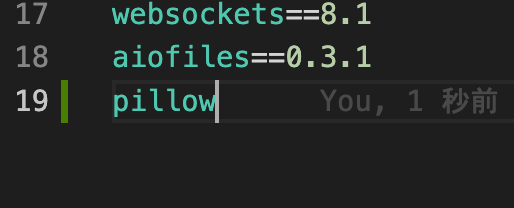
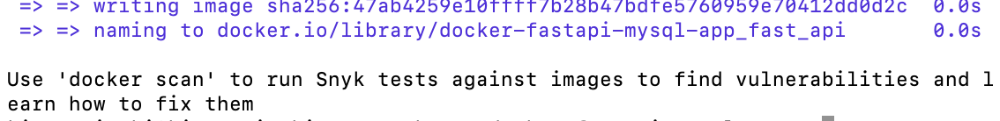

# Pythonのライブラリ／パッケージを追加でインストールしたい場合

## 「pip install ~ 」でインストールできるもの
- [pypi](https://pypi.org/)に公開されているパッケージは基本的にpipでインストールできると思います

### 手順
1. `docker-fastapi-mysql-app/docker/fastapi/requirements.txt`にパッケージ名を追記する（バージョンは省略可）
    - 以下の画像は`pillow`をインストールしたい場合の例

    

2. Macの場合はターミナル、Windowsの場合はコマンドプロンプトで `docker-fastapi-mysql-appフォルダ`に移動し、`docker-compose build`を実行
    - `docker-compose up`を実行中の場合は一度止めてください

3. 完了したら再度`docker-compose up`を実行する
    - 完了すると以下の画像のようなメッセージが出る

    

> ⚠️普段`appフォルダ`をエディタで開いている場合は、もう一つ上の階層にある`docker-fastapi-mysql-app`を開くと`docker`というフォルダが見つかると思います

## pipでインストール出来なさそうなもの
- TA／SAに相談してください!